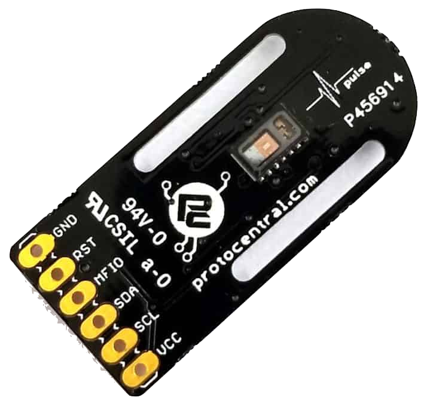
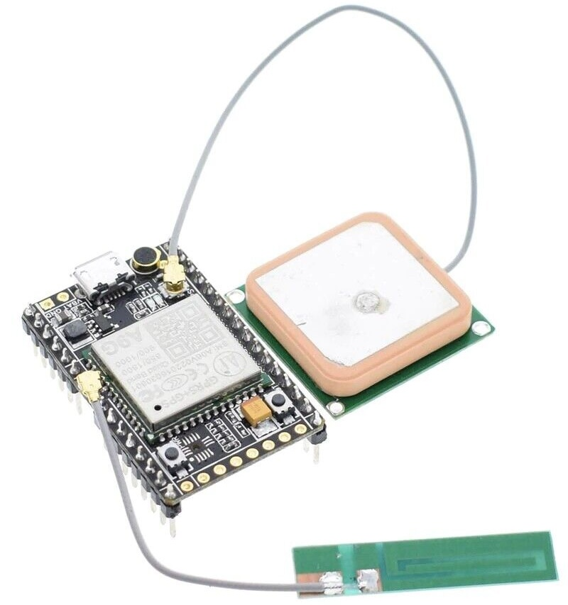
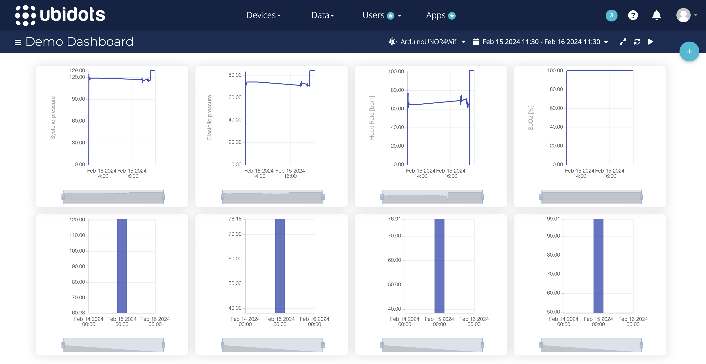
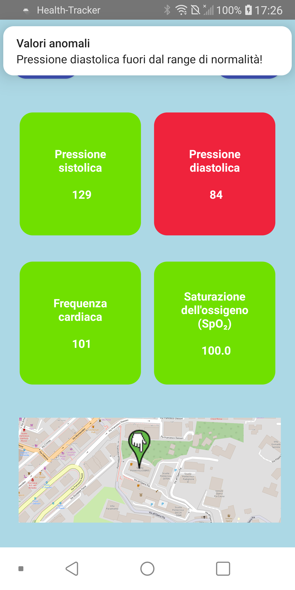
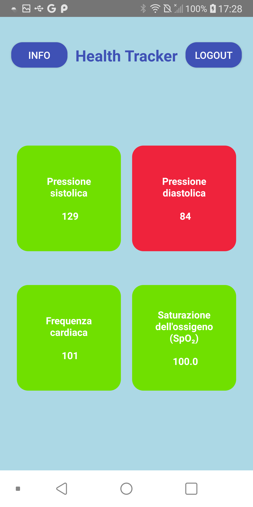

# Health Tracker 
## Introduzione e obiettivi
Ciò che è stato realizzato in questo progetto è un dispositivo indossabile che monitora parametri
vitali quali pressione sistolica e diastolica, frequenza cardiaca e saturazione dell’ossigeno e restituisce la posizione in tempo reale del soggetto che lo indossa. La creazione di tale dispositivo è
finalizzata al monitoraggio di soggetti da parte di due categorie di utenti:  
- caregivers: familiari e allenatori, che hanno accesso sia ai parametri vitali sia alla posizione in tempo reale;
- medici: aventi accesso solo ai parametri vitali, in modo tale da monitorare su grande scala tutti gli utilizzatori del dispositivo.

## Materiali e metodi
### Materiali 
Per la realizzazione hardware del dispositivo è stata utilizzata una board Arduino Uno R4 Wi-Fi, alimentata da una batteria a 9V, e due sensori:  
- ProtoCentral Pulse Express (MAX32664), per l’acquisizione della pressione sistolica e diastolica, frequenza cardiaca e saturazione dell’ossigeno (a sinistra in figura)
- A9G Low-Power GSM/GPRS+GPS Module, per l’acquisizione della coordinate GPS. (a destra in figura)  
                      
### Metodi 
L’architettura di base per il funzionamento di tale progetto `e la seguente:  

- Comunicazione Arduino-BLE periferico: per mezzo della libreria <ArduinoBLE.h> è stata realizzata la comunicazione BLE con l’obiettivo di comunicare i fallimenti delle operazioni chiave per il corretto funzionamento del dispositivo.
- Comunicazione Arduino-MQTT broker: per mezzo della libreria <PubSubClient.h> è stato effettuato il publish dei topic /sys, /dia, /hr e /spo2 sul server pubblico Mosquitto, che funge da MQTT broker.
- Comunicazione MQTT broker-Ubidots: è stato utilizzato un middleware scritto in JavaScript che, con Node.js, permette di essere contemporaneamente un subscriber per il broker e un publisher per ubidots.
- Comunicazione MQTT broker-utente finale: è stata realizzata un’app con AndroidStudio che permette a diversi subscriber di ricevere topic differenti e visualizzarli di conseguenza in base al ruolo scelto. La gestione degli utenti è realizzata tramite il database Google Firebase.
## Risultati
La visualizzazione dei dati in tempo reale nei tre end point, rispettivamente Ubidots, caregiver e medico, è la seguente:
  
  

## Limitazioni e prospettive future
### Limitazioni
Il progetto presenta le seguenti limitazioni:  
- Il modulo utilizzato per l’acquisizione della posizione GPS funziona solo all’esterno.
- Il dispositivo necessita di una connessione Wi-Fi, di conseguenza l’utilizzatore ha bisogno di avere sempre con se il telefono con cui effettuare l’hotspot.
- Il dispositivo è ingombrante, di conseguenza è poco pratico durante le attività quotidiane.
### Prospettive future
Come implementazione futura si può utilizzare una microSIM per implementare la connessione GSM/GPRS, la quale era un obiettivo iniziale del progetto ma che non è stata realizzata a causa di limitazioni nel budget imposto.
